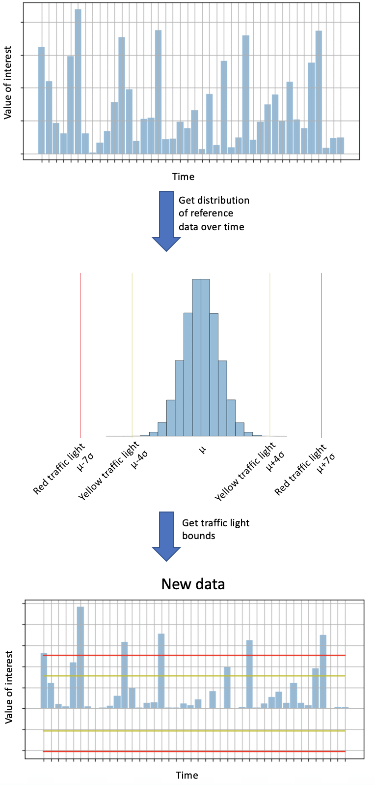

=============
Main concepts
=============

There are many scenarios in which you want to monitor whether a dataset remains stable over time.
For example, if we train a classification model using our data at time `T0-T4`, we want to ensure that all data at `T5`, `T6`, etc. come from a similar distribution.
Because if these distributions change, the performance of your classifier may also change.
And you probably want to know this, as you might want to retrain your model.
 
To monitor the stability over time, we have developed popmon (**pop**\ ulation shift **mon**\ itor). Popmon takes as input a DataFrame (either pandas or Spark), of which one of the columns should represent the date, and will then produce a report that indicates how stable all other columns are over time.
 
For each column, the stability is determined by taking a reference (for example the data on which you have trained your classifier) and contrasting each time slot to this reference. This can be done in various ways:

* Profiles: for example tracking the mean over time and contrasting this to the reference data. Similar analyses can be done with other summary statistics, such as median, min, max or quartiles.
* :doc:`Comparisons <comparisons>`: statistically comparing each time slot to the reference data (for example using Kolmogorov-Smirnov, chi-squared, or Pearson correlation).

The reference can be defined in four different ways:

1. Using the DataFrame on which you build the stability report as the reference, essentially allowing you to identify outlier time slots within the provided data.
2. Using a separate reference DataFrame (for example the data on which your classifier was trained, as in the above example), allowing you to identify which time slots deviate from this reference DataFrame.
3. Using a sliding window, allowing you to compare each time slot to a window of preceding time slots (by default the 10 preceding time slots).
4. Using an expanding reference, allowing you to compare each time slot to all preceding time slots.

We define the normalized residual of a value of interest with respect to the selected reference as:

.. code-block:: text

    pull = (value - reference[mean]) / reference[standard deviation]

This quantity is known as the "pull" of the value. The pull is calculated for every profile
of every feature. The size of the pull is used in `popmon`
to flag any significant differences over time with respect to the reference. Note that you need to have at least two time slots in the reference in order to calculate the pull. 

We use traffic lights to indicate where large deviations from the reference occur.
To see how these work, consider the following example.
Suppose we have a value of interest
(either a profile, i.e. summary statistic tracked over time; or a z-score normalized comparison,
i.e. a statistical test, e.g. Kolmogorov-Smirnov).
To determine the difference compared to the reference, we also compute the value of interest
on the reference data (top panel) and determine the mean and standard deviations across time units
(center panel). We then determine the traffic lights as follows:

* 🟢 Green traffic light: indicates that there is no meaningful difference compared to the reference, i.e. the value of interest is less than four standard deviations away from the reference.
* 🟡 Yellow traffic light: indicates that there is a moderate difference compared to the reference, i.e. the value of interest is between four and seven standard deviations away from the reference.
* 🔴 Red traffic light: indicates that there is a big difference compared to the reference, i.e. the value of interest is more than seven standard deviations away from the reference.

Of course, the exact thresholds (four and seven standard deviations) can be configured as a parameter. These traffic light bounds are then applied to the value of interest on the data from our initial DataFrame (bottom panel).

   
   Illustration of how traffic light bounds are determined using reference data.

For speed of processing, the data is converted into histograms prior to the comparisons. This greatly simplifies comparisons of large amounts of data with each other, which is especially beneficial for Spark DataFrames. In addition, it enables you to store the histograms together with the report (since the histograms are just a fraction of the size of the original data), making it easy to go back to a previous report and investigate what happened.
