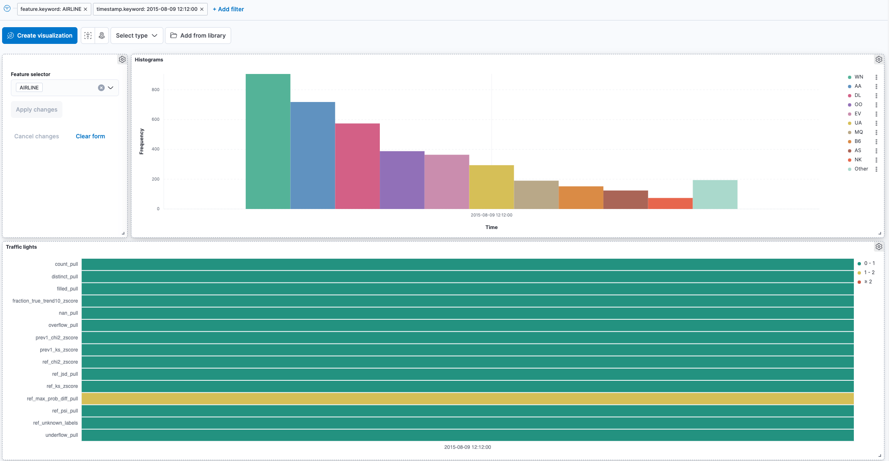

# Example integration of popmon with Kibana

This directory is part of the examples on how to integrate popmon with third party dashboarding tools.
See [Reports and integrations](https://github.com/ing-bank/popmon#Reports-and-integrations) for additional information.

Kibana is the dashboarding visualization tool for Elasticsearch and offers some nifty ways of zooming in on the stability of your data.
In this tutorial we use Docker (compose) to launch the Elasticsearch and Kibana instances. 
Then, we use the Elasticsearch Python SDK to populate an index with popmon's results.
Finally, we will use Kibana to create an interactive dashboard akin to popmon's' HTML reports.

Before we head into the steps, we will look at a couple of screenshots to understand how the dashboard could look like:


_This dashboard consists of a feature selector, histograms over time, individual profiles and the traffic lights._


_Hovering over the histograms allows for interactive inspection of individual histograms._


_Zooming in on a particular time slice is also supported._

## Setup the environment

Start the Docker containers ([Docker](https://docs.docker.com/get-docker/) needs to be installed and running):
```bash
docker-compose -f elastic-kibana.yml up
```

The popmon and the Elasticsearch Python SDK can be installed with pip:
```bash
pip install popmon elasticsearch
```

## Populate the Elasticsearch index

Running the script `popmon_to_elastic.py` will perform these steps:

- Load the Flights dataset (see the flight_delays.py example for details)
- Use popmon to obtain the histograms and dataset shift statistics
- Store these to a pickle file (for further development)
- Convert the data in the datastore to JSON
- Send it to Elasticsearch in bulk via the `elasticsearch` Python SDK

## Create and view the dashboard

The popmon data is now available to visualize!
You could start with by importing the example dashboard `popmon-dashboard.ndjson` at `http://localhost:5601/app/management/kibana/objects`.
After importing, visit `http://localhost:5601/app/dashboards/` to view the dashboard!

## Caveats

This tutorial roughly describes how one could integrate with Elasticsearch and Kibana as a proof-of-concept and is provided on an as-is basis.
Further development is needed to completely replace the HTML report, however it should be a decent start.
It's also recommended using your own ELK stack setup, when needing this in a production environment.
